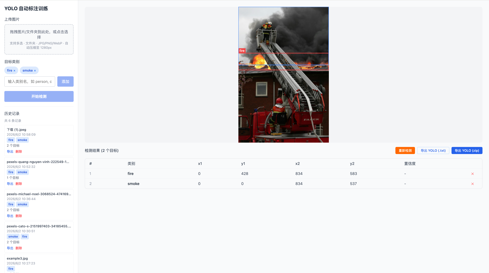

# AutoLabeling

基于 NVIDIA LocateAnything-3B 视觉大模型 + YOLOv26 的端到端自动标注训练系统。

**核心流程**：图片 → VLM 自动定位标注 → 人工修正 → 导出 YOLO 数据集 → 训练 → 验证



## 技术栈

| 层 | 技术 |
|---|------|
| 视觉定位 | NVIDIA LocateAnything-3B（Qwen2.5-3B + MoonViT） |
| 目标检测 | YOLOv26（Ultralytics） |
| 后端 | Python FastAPI + PostgreSQL + SSE |
| 前端 | React + TypeScript + Vite + Tailwind CSS |
| 状态管理 | TanStack Query |

## 快速开始

### 环境要求

- Python 3.12+
- Node.js 20+
- PostgreSQL 16+
- 24GB 统一内存（Apple Silicon）或 12GB+ 显存（NVIDIA）

### 1. 安装依赖

```bash
# 后端
cd backend
python3 -m venv .venv
source .venv/bin/activate
pip install -r requirements.txt

# 前端
cd ../frontend
npm install
```

### 2. 创建数据库

```bash
psql -d postgres -c "CREATE DATABASE locate_anything;"
```

### 3. 配置环境变量

```bash
cp backend/.env.example backend/.env
# 按需修改 DATABASE_URL、DEVICE 等
```

### 4. 下载模型（可选，首次运行自动下载）

```bash
.venv/bin/hf download nvidia/LocateAnything-3B --local-dir backend/model
```

### 5. 启动

```bash
./start.sh
```

- 前端：http://localhost:5173
- 后端：http://localhost:8000
- API 文档：http://localhost:8000/docs

## 项目结构

```
locate-anything/
├── backend/
│   ├── app/
│   │   ├── api/routes/       # REST API 路由
│   │   ├── core/             # 配置、数据库、中间件、日志
│   │   ├── models/           # SQLAlchemy ORM
│   │   ├── repositories/     # 数据访问层
│   │   ├── schemas/          # Pydantic 模型
│   │   ├── services/         # 模型推理、YOLO 训练、导出
│   │   └── main.py           # FastAPI 入口
│   ├── alembic/              # 数据库迁移
│   └── requirements.txt
├── frontend/
│   └── src/
│       ├── components/       # React 组件
│       ├── pages/            # 页面
│       ├── hooks/            # TanStack Query hooks
│       ├── services/         # API 调用层
│       └── types/            # TypeScript 类型
├── docker-compose.yml        # Docker 一键部署
├── start.sh                  # 本地一键启动
└── README.md
```

## 功能

- **VLM 自动标注**：上传图片，输入目标描述（如 `fire, smoke`），模型自动检测并绘制边界框
- **批量处理**：支持文件夹上传，串行批量标注
- **手工修正**：删除错误的检测框，修正类别标签
- **历史管理**：按标签筛选历史记录，重新检测
- **YOLO 训练**：选中标注记录，一键训练 YOLOv26，SSE 实时进度
- **模型验证**：用训练好的 YOLO 模型对图片进行推理验证
- **YOLO 导出**：支持单张/批量导出 YOLO 格式标注文件

## API 概览

| 方法 | 路径 | 说明 |
|------|------|------|
| POST | `/api/v1/detect` | VLM 检测 |
| GET | `/api/v1/detections` | 历史列表 |
| GET | `/api/v1/detections/{id}/export` | 导出 YOLO 标注 |
| POST | `/api/v1/detections/{id}/boxes/{box_id}/delete` | 删除检测框 |
| POST | `/api/v1/train/jobs` | 创建训练任务 |
| GET | `/api/v1/train/jobs/{id}/progress/stream` | SSE 训练进度 |
| POST | `/api/v1/train/jobs/{id}/predict` | YOLO 模型推理 |

## License

本项目代码 MIT。

LocateAnything-3B 模型遵循 [NVIDIA License](https://huggingface.co/nvidia/LocateAnything-3B/blob/main/LICENSE)（非商用）。
