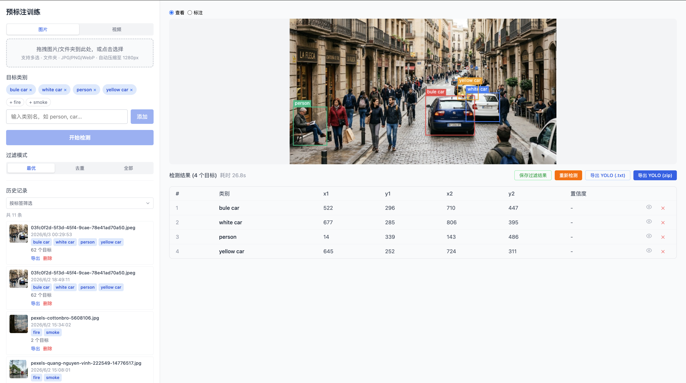
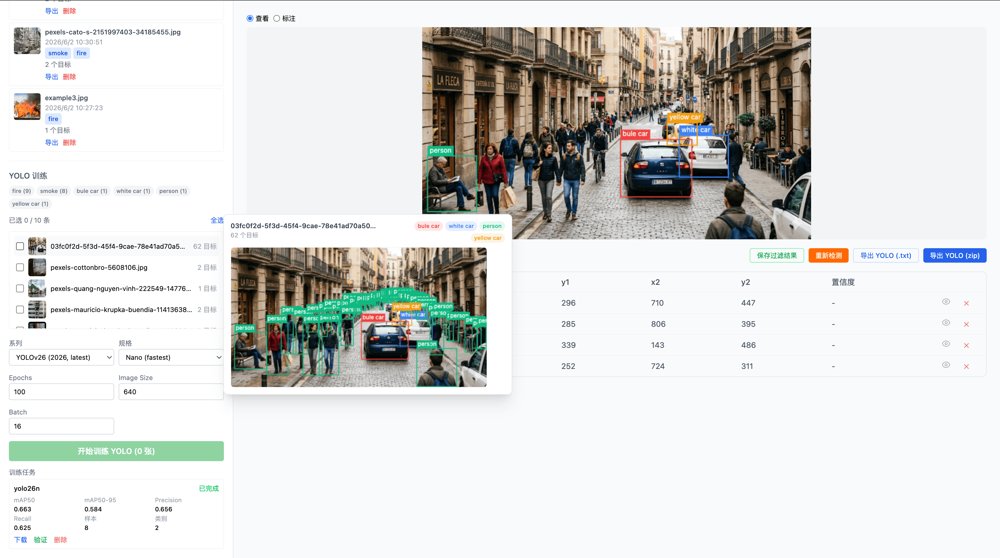
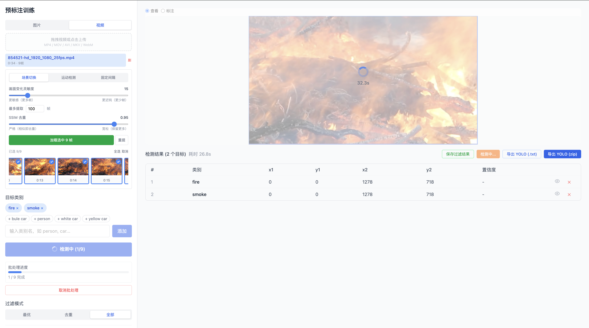
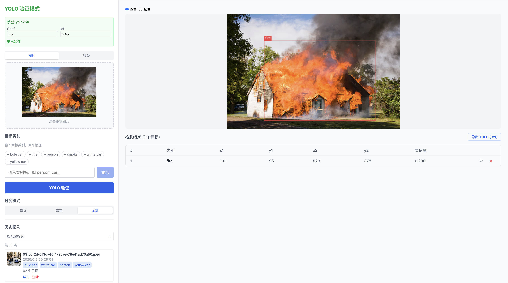

# VLM-AutoYOLO

[English](README.md) | 简体中文

**端到端目标检测自动标注与 YOLO 训练平台。** 基于 NVIDIA LocateAnything-3B 视觉大模型的智能数据标注系统，支持 VLM 自动标注、SAM2.1 mask 精修、人工修正、一键 YOLO 训练（检测 + 分割）、多格式数据集导出、视频关键帧提取与模型验证。

> 图片扔进去，模型训出来 — VLM 自动标注 → SAM2 mask 精修 → 人工修正 → 多格式导出 → YOLO 训练 → 模型验证。

**完整计算机视觉工作流**：VLM 预标注 → SAM2 分割 → 手动修正 → 多格式导出 → YOLO 训练（检测/分割） → 模型验证

**核心功能**：
- 🤖 **VLM 自动标注**：基于 LocateAnything-3B 的开放词汇目标检测
- 🎯 **SAM2 分割**：bbox → 像素级 mask 精修（SAM 2.1）
- 🎥 **视频标注**：智能关键帧提取（场景/运动/间隔检测）
- ✏️ **人工修正**：Canvas 画布标注，支持 NMS 过滤，BBox/Mask 独立开关
- 🚀 **一键训练**：YOLOv8/v11/v26（检测 + 分割），实时 SSE 进度
- 📦 **多格式导出**：YOLO、YOLO-Seg、COCO JSON、Pascal VOC XML、CreateML JSON
- ✅ **模型验证**：批量图片/视频测试，实时 MJPEG 与 SSE 视频推理
- 🌐 **国际化**：中英文双语界面
- 🎨 **主题**：亮色 / 暗色模式，跟随系统偏好

## 文档

📚 **[用户指南 (中文)](docs/guide/README.md)** | 📚 **[User Guide (English)](docs/guide/en/README.md)**

完整指南涵盖：
- 快速开始教程
- 标注最佳实践
- 训练参数调优
- 模型优化与部署

## 截图

| VLM 预标注与人工修正 | YOLO 训练 |
|------------------|-----------|
|  |  |

| 视频关键帧入口 | 模型验证 |
|--------------|---------|
|  |  |

## 技术栈

| 层 | 技术 |
|---|------|
| 视觉定位 | NVIDIA LocateAnything-3B（Qwen2.5-3B + MoonViT） |
| 分割精修 | SAM 2.1（Segment Anything Model 2） |
| 目标检测 | YOLOv8 / v11 / v26 — 检测 & 分割（Ultralytics） |
| 后端 | Python FastAPI + PostgreSQL + SSE |
| 前端 | React + TypeScript + Vite + Tailwind CSS + antd |
| 状态管理 | TanStack Query + ahooks |
| 国际化 | i18next（中文 / 英文） |
| 视频处理 | ffmpeg（场景检测 / 运动检测 / 间隔提取） |
| 工程化 | pnpm、ESLint、Prettier |

## 快速开始

### Docker 部署

> **环境要求：** Linux 或 Windows (WSL2) + NVIDIA GPU + [NVIDIA Container Toolkit](https://docs.nvidia.com/datacenter/cloud-native/container-toolkit/latest/install-guide.html)。
> **macOS 不支持** — Docker on Mac 无 GPU 直通能力，请使用[手动部署](#手动部署)。

**使用预构建镜像快速启动：**

```bash
# 下载 docker-compose.yml
curl -O https://raw.githubusercontent.com/Somnusochi/VLM-AutoYOLO/master/docker-compose.yml

# 启动所有服务
docker compose up -d

# 访问应用
open http://localhost  # 前端界面
open http://localhost:8000/docs  # API 文档
```

**从源码构建：**

```bash
git clone https://github.com/Somnusochi/VLM-AutoYOLO.git
cd VLM-AutoYOLO
docker compose up -d --build
```

**服务列表：**

| 服务 | 端口 | 说明 |
|------|------|------|
| 前端 | 80 | React 界面（Nginx） |
| 后端 | 8000 | FastAPI 服务器 |
| 数据库 | 5432 | PostgreSQL |

**GPU 支持：**

如需使用 NVIDIA GPU 加速，编辑 `docker-compose.yml` 并在 backend 服务中添加 GPU 配置：

```yaml
backend:
  # ... 其他配置 ...
  deploy:
    resources:
      reservations:
        devices:
          - driver: nvidia
            count: 1
            capabilities: [gpu]
  environment:
    DEVICE: cuda
```

**持久化存储：**

Docker 卷用于：
- `pgdata`: 数据库数据
- `model-cache`: 下载的 VLM 和 SAM2 模型
- `uploads`: 用户上传的图片/视频
- `training-data`: YOLO 训练任务和输出

备份数据：
```bash
docker compose exec db pg_dump -U postgres autolabeling > backup.sql
```

恢复数据：
```bash
cat backup.sql | docker compose exec -T db psql -U postgres autolabeling
```

**查看日志：**
```bash
# 所有服务
docker compose logs -f

# 指定服务
docker compose logs -f backend
docker compose logs -f frontend
```

### 手动安装

如果不想使用 Docker，按以下步骤操作：

**环境要求：**

| 资源 | 最低配置 | 推荐配置 |
|------|---------|---------|
| Python | 3.12+ | 3.12+ |
| Node.js | 22+ | 22+ |
| PostgreSQL | 16+ | 16+ |
| ffmpeg | 任意版本 | — |
| macOS | Apple Silicon 16GB 统一内存 | 24GB+ |
| NVIDIA GPU | 10GB 显存 | 12GB+ |

**安装：**

```bash
# 1. 克隆仓库
git clone https://github.com/Somnusochi/VLM-AutoYOLO.git
cd VLM-AutoYOLO

# 2. 后端
cd backend
python3 -m venv .venv
source .venv/bin/activate  # Windows: .venv\Scripts\activate
pip install -r requirements.txt
cd ..

# 3. 前端
cd frontend
pnpm install
cd ..

# 4. 数据库
psql -d postgres -c "CREATE DATABASE autolabeling;"

# 5. 配置
cp backend/.env.example backend/.env

# 6. 数据库迁移
cd backend
PYTHONPATH=. alembic upgrade head
```

**下载模型（可选）：**

```bash
# 首次运行会自动下载，网络慢可预下载
huggingface-cli download nvidia/LocateAnything-3B --local-dir backend/model
```

**启动：**

```bash
# macOS / Linux
./start.sh

# Windows
start.bat
```

| 服务 | 地址 |
|------|------|
| 前端 | http://localhost:5173 |
| 后端 | http://localhost:8000 |
| API 文档 | http://localhost:8000/docs |

## 项目结构

```
VLM-AutoYOLO/
├── backend/
│   ├── app/
│   │   ├── api/
│   │   │   ├── deps.py              # 依赖注入
│   │   │   └── routes/              # REST API
│   │   │       ├── detection.py     # 检测 CRUD、手动标注、模型管理
│   │   │       ├── export.py        # YOLO 格式导出
│   │   │       ├── predict.py       # 模型验证、视频推理（MJPEG/SSE）
│   │   │       ├── train.py         # 训练、SSE、重新训练
│   │   │       └── video.py         # 视频上传、关键帧提取
│   │   ├── core/                    # 配置、数据库、中间件、日志、异常
│   │   ├── models/                  # SQLAlchemy ORM
│   │   │   ├── detection.py         # 检测 & 标注框
│   │   │   ├── train.py             # 训练任务
│   │   │   └── video.py             # 视频 & 关键帧
│   │   ├── repositories/            # 数据访问层
│   │   ├── schemas/                 # Pydantic 模型（驼峰命名）
│   │   ├── services/
│   │   │   ├── box_filter.py        # 标注框过滤、NMS 去重
│   │   │   ├── frame_utils.py       # 帧预测与标注绘制
│   │   │   ├── locate_anything.py   # VLM 推理引擎
│   │   │   ├── sam2_service.py      # SAM2 分割服务
│   │   │   ├── video_service.py     # ffmpeg 关键帧提取 + SSIM 去重
│   │   │   ├── trainer.py           # YOLO 训练 + 验证
│   │   │   ├── export.py            # 多格式标注导出
│   │   │   ├── yolo_format.py       # YOLO 格式转换（bbox + seg）
│   │   │   ├── coco_format.py       # COCO JSON 导出
│   │   │   ├── voc_format.py        # Pascal VOC XML 导出
│   │   │   └── createml_format.py   # CreateML JSON 导出
│   │   └── main.py                  # FastAPI 入口
│   ├── alembic/                     # 数据库迁移
│   └── requirements.txt
├── frontend/
│   └── src/
│       ├── components/              # UI 组件
│       │   ├── DetectionCanvas.tsx  # 图片标注画布
│       │   ├── DetectionResult.tsx  # 检测结果展示
│       │   ├── VideoPanel.tsx       # 视频上传与关键帧时间轴
│       │   ├── VideoDetail.tsx      # 关键帧详情
│       │   ├── VideoValidator.tsx   # 视频验证（训练模型）
│       │   ├── KeyframeGrid.tsx     # 关键帧网格
│       │   ├── TrainingPanel.tsx    # YOLO 训练面板
│       │   ├── HistoryList.tsx      # 检测历史列表
│       │   ├── FilterPanel.tsx      # 类别与标签筛选面板
│       │   ├── ImageUploader.tsx    # 图片拖拽上传
│       │   ├── ModelSelector.tsx    # YOLO 模型系列选择器
│       │   ├── BatchProgress.tsx    # 批量标注进度
│       │   ├── CategoryInput.tsx    # 类别快速填充输入框
│       │   ├── ResultTable.tsx      # 检测结果表格
│       │   ├── ValidationSettings.tsx # Conf/IoU 阈值控制
│       │   ├── Layout.tsx           # 应用布局容器
│       │   ├── Sidebar.tsx          # 导航侧边栏
│       │   ├── ThemeProvider.tsx     # 亮色/暗色主题提供者
│       │   ├── ErrorBoundary.tsx    # React 错误边界
│       │   ├── LoadingSkeleton.tsx  # 加载骨架屏
│       │   └── ...
│       ├── pages/
│       │   └── Home.tsx             # 主页面（图片/视频双模式）
│       ├── hooks/                   # 自定义 Hooks
│       │   ├── useDetection.ts      # 检测状态与操作
│       │   ├── useBatchDetection.ts # 批量检测编排
│       │   ├── useHomeState.ts      # 主页状态管理
│       │   ├── useTheme.tsx         # 主题切换 Hook
│       │   └── useYoloValidation.ts # 验证状态与流式推理
│       ├── i18n/                    # 国际化
│       │   ├── config.ts            # i18next 配置
│       │   └── locales/             # en.json、zh.json
│       ├── services/
│       │   ├── api.ts               # 统一 API 层（驼峰命名）
│       │   └── request.ts           # HTTP 客户端封装
│       ├── lib/                     # 工具函数
│       │   ├── constants.ts         # 应用常量
│       │   ├── filterBoxes.ts       # 客户端标注框过滤
│       │   ├── formatTime.ts        # 时间格式化
│       │   ├── parsers.ts           # 响应解析器
│       │   └── yoloExport.ts        # 浏览器端 YOLO 标注导出
│       └── types/                   # TypeScript 类型
│           └── index.ts
├── docs/                            # 截图与用户指南
│   ├── guide/                       # 中文用户指南
│   └── guide/en/                    # 英文用户指南
├── docker-compose.yml
├── start.sh / start.bat             # 启动脚本
└── README.md
```

## 功能

### VLM 预标注

上传图片或视频关键帧，输入目标描述（如 `fire, smoke`、`Monster Energy drink`），LocateAnything-3B 自动检测并绘制边界框。

- 支持任意开放词汇描述，英文短语效果最佳
- 图片自动压缩至安全分辨率，防止显存溢出
- 支持文件夹 / 视频关键帧批量上传，流式返回结果
- 流式处理：第一张结果立即可见，后续结果实时追加

### SAM2 分割

VLM 检测出 bbox 后，可启用 SAM2（Segment Anything Model 2）自动生成精确的像素级 mask 轮廓。

- 勾选「启用 SAM2 分割」复选框后，每次检测自动运行
- SAM 2.1 模型（base+ / large 可选），惰性加载 + 闲置自动卸载
- mask 多边形半透明渲染在画布上，bbox 和 mask 可独立开关显示
- 结果表格显示每个目标的 mask 顶点数
- 预览浮窗同步渲染 mask，同样支持开关

### 视频标注

上传视频，智能提取关键帧，挑选后批量标注。

- **三种提取方式**：场景切换检测、运动检测（光流法）、固定间隔
- **SSIM 去重**：自动去除相似帧，阈值可调
- **时间轴预览**：水平时间轴浏览所有关键帧，点击可看大图
- **多选机制**：勾选需要标注的帧，全选 / 取消全选，加载选中帧到标注队列
- 关键帧加载后走标准 VLM 预标注流程，与图片标注体验一致

### 手动标注

Canvas 画框模式，自由绘制边界框。

- 查看/标注双模式切换
- 画框前选择类别，历史类别快速填充
- VLM 预标注 → 删错框 → 补漏框，协同工作
- 支持"全部 / 最优 / NMS 去重"过滤模式
- 过滤设置可保存到检测记录，后端导出和训练会使用保存后的过滤结果
- 支持临时隐藏单个标注框，便于检查密集检测结果
- 单帧重新检测

### 历史管理

- 缩略图 + 类别标签展示
- 按标签多选筛选
- 点击查看详情，支持重新检测
- 单张/批量导出多格式数据集：YOLO、YOLO Segmentation、COCO JSON、Pascal VOC XML、CreateML JSON
- 导出下拉菜单选择格式，一键下载 zip
- 保存过滤结果后历史列表实时更新

### YOLO 训练

- 多系列可选：YOLOv8 / v11 / v26（n/s/m/l/x）
- 任务类型：目标检测（Detect）、实例分割（Segment）
- 分割训练自动使用 SAM2 产出的 polygon 标签（无 polygon 时 fallback 到 bbox）
- 标签筛选 + 缩略图预览，精确选择训练数据
- 数据集拆分：预设比例（70/20/10、80/20 等），自动分 train/val/test
- 一键训练，SSE 实时推送 Epoch / Loss / mAP 进度
- 训练完成自动导出 ONNX，可下载 PT / ONNX 模型和数据集 zip
- 训练曲线图表（results.png）可在详情模态框中查看
- 训练任务与检测记录使用独立关联表保存，支持 JSONB 指标与类别映射
- 训练数据生成会应用检测记录中保存的过滤模式

### 模型验证

- **双模型源支持**：支持使用训练出的 YOLO 模型，或手动上传本地外部 YOLO 模型（`.pt` 文件）进行推理验证
- **Conf / IoU 调节**：支持置信度阈值 (Conf) 与重叠阈值 (IoU) 滑块实时微调框过滤效果
- **图片多图批量验证**：支持对选中的多张测试图片进行批处理验证，置信度及边界框一目了然
- **视频验证**（三种模式）：
  - **MJPEG 实时流**（`validate-mjpeg`）：逐帧标注的视频流，支持训练模型或外部模型，带交互式暂停/恢复覆盖层和冻结帧捕获
  - **SSE 预测流**（`predict-video-stream`）：实时 JSON 事件流，逐帧返回检测结果、进度追踪和元数据
  - **同步批量预测**（`predict-video`）：按可配置间隔提取帧，运行推理，一次性返回全部结果
- **视频播放完毕自动呈现**”播放完成，点击重播”毛玻璃覆盖层
- **底栏”重新播放”按钮**，防浏览器缓存一键重新拉流推理验证
- **容器固定 16:9 比例自适应**（aspect-video），消除所有加载和切换时的画面尺寸收缩与抖动
- 验证结果是临时结果，可直接导出单图 YOLO `.txt` 标注文件

### 模型管理

- **惰性加载**：VLM 和 SAM2 模型在首次使用时自动加载，闲置超时后自动卸载
- **闲置看门狗**：默认 10 分钟无请求后自动释放 GPU 显存（可通过 `MODEL_IDLE_TIMEOUT_SECONDS` 配置）
- **状态查询**：查询 VLM 模型是否已加载（`GET /api/v1/model/status`）
- **手动卸载**：按需释放 GPU 内存（`POST /api/v1/model/unload`）

### 重新训练

- **一键重训**：使用与上次训练完全相同的检测数据集和超参数重新训练（`POST /api/v1/train/jobs/{id}/retrain`）
- 适用于 A/B 对比或训练失败后快速重试，无需重新选择数据

## API 概览

所有响应字段使用驼峰命名（camelCase），错误响应携带正确的 HTTP 状态码。

### 检测与标注

| 方法 | 路径 | 说明 |
|------|------|------|
| POST | `/api/v1/detect` | VLM 预标注（multipart，支持 `use_sam2` 参数） |
| GET | `/api/v1/detections` | 历史列表（分页，返回 `data` + `total` + `page` + `pageSize`） |
| GET | `/api/v1/detections/{id}` | 检测详情 |
| GET | `/api/v1/detections/{id}/image` | 检测原图 |
| POST | `/api/v1/detections/{id}/boxes` | 手动添加标注框 |
| PUT | `/api/v1/detections/{id}/boxes` | 替换检测记录的全部标注框 |
| PUT | `/api/v1/detections/{id}/boxes/{boxId}` | 修改标注框坐标 |
| POST | `/api/v1/detections/{id}/boxes/{boxId}/delete` | 删除标注框 |
| PUT | `/api/v1/detections/{id}/filter-settings` | 保存过滤模式与 NMS IoU |
| POST | `/api/v1/detections/{id}/delete` | 删除检测记录 |
| GET | `/api/v1/detections/{id}/export` | 导出单图 YOLO 标注 |
| POST | `/api/v1/detections/export-batch` | 多格式批量导出：`yolo`、`yolo-seg`、`coco`、`voc`、`createml`（zip） |
| GET | `/api/v1/model/status` | VLM 模型加载/卸载状态 |
| POST | `/api/v1/model/unload` | 从内存中卸载 VLM 模型 |

### 视频

| 方法 | 路径 | 说明 |
|------|------|------|
| POST | `/api/v1/videos/upload` | 上传视频（multipart） |
| GET | `/api/v1/videos` | 视频列表（分页） |
| GET | `/api/v1/videos/{id}` | 视频详情（含关键帧） |
| GET | `/api/v1/videos/{id}/file` | 视频文件下载 |
| POST | `/api/v1/videos/{id}/extract-keyframes` | 提取关键帧 |
| GET | `/api/v1/videos/{id}/keyframes/{keyframeId}/image` | 关键帧图片 |
| POST | `/api/v1/videos/{id}/delete` | 删除视频及关键帧 |

### 训练

| 方法 | 路径 | 说明 |
|------|------|------|
| POST | `/api/v1/train/jobs` | 创建训练任务（支持 trainRatio/valRatio 拆分、taskType） |
| GET | `/api/v1/train/jobs` | 训练任务列表（分页） |
| GET | `/api/v1/train/variants` | 可用 YOLO 系列 |
| GET | `/api/v1/train/jobs/{id}/progress/stream` | SSE 训练进度 |
| GET | `/api/v1/train/jobs/{id}/download` | 下载 PT 模型 |
| GET | `/api/v1/train/jobs/{id}/dataset` | 下载数据集 zip（images + labels + data.yaml） |
| GET | `/api/v1/train/jobs/{id}/charts/{name}` | 训练曲线图（results.png 等） |
| POST | `/api/v1/train/jobs/{id}/export-onnx` | 导出 / 下载 ONNX 模型 |
| POST | `/api/v1/train/jobs/{id}/predict` | YOLO 模型推理验证（图片） |
| POST | `/api/v1/train/jobs/{id}/retrain` | 使用相同设置重新训练 |
| GET | `/api/v1/train/jobs/{id}/validate-mjpeg/{video_id}` | 使用训练模型验证视频（MJPEG 实时流） |
| POST | `/api/v1/train/jobs/{id}/predict-video-stream` | 使用训练模型验证视频（SSE 流） |
| POST | `/api/v1/train/jobs/{id}/predict-video` | 使用训练模型验证视频（同步批量） |
| POST | `/api/v1/train/jobs/{id}/delete` | 删除训练任务 |
| POST | `/api/v1/train/upload-model` | 上传外部本地 YOLO 模型 (.pt) 并获取 Token |
| POST | `/api/v1/train/validate-image/{token}` | 使用外部模型验证图片 |
| GET | `/api/v1/train/validate-mjpeg/{token}/{video_id}` | 使用外部模型验证视频（MJPEG 实时流） |

### 响应格式

**成功（单条）** → `200/201`：
```json
{ "data": { "id": "...", "fileName": "...", "createdAt": "..." } }
```

**成功（列表）** → `200`：
```json
{ "data": [...], "total": 100, "page": 1, "pageSize": 20 }
```

**成功（删除）** → `204`（空响应体）

**错误** → `4xx/5xx`：
```json
{ "error": { "code": "NotFoundError", "message": "Video not found: xxx" } }
```

## 跨平台

| 平台 | 推理后端 | 训练后端 |
|------|---------|---------|
| macOS (Apple Silicon) | MPS | MPS |
| Linux / Windows (NVIDIA) | CUDA | CUDA |

设备自动检测，优先级：CUDA → MPS。可通过 `DEVICE` 环境变量手动指定。
**CPU 推理不被支持** — LocateAnything-3B 需要 GPU 加速。

### 推理性能基准

测试环境：Windows 11 + RTX 3080 10GB，7 张猫图，各 3 轮，`max_new_tokens=512`。
长边自动限制 800px（对齐 ViT patch 边界），模型首次加载约 22s。

| 模式 | 图片尺寸 | 平均耗时 | 范围 | 稳定平均* |
|------|---------|---------|------|----------|
| VLM only | 大图 (800×640) | 1.0s | 1.0–1.1s | **1.0s** |
| VLM only | 缩略图 | 367ms | 352–391ms | **367ms** |
| **VLM only** | **全部 7 张** | **1.6s** | 0.4–1.1s | **586ms** |
| VLM + SAM2 | 大图 (800×640) | 3.4s | 3.4s | **3.4s** |
| VLM + SAM2 | 缩略图 | 475ms | 457–496ms | **475ms** |
| **VLM + SAM2** | **全部 7 张** | **1.4s** | 0.5–3.4s | **1.3s** |

> *稳定平均排除第 1 轮第 1 张图（含模型加载）。
>
> **显存占用**：VLM 模型加载后约 5.5GB；推理峰值约 7.5GB。10GB 显存足够使用，建议关闭无关 GPU 应用。
>
> **性能说明**：长边上限根据 GPU 显存自动选择（<12GB → 800px，12–16GB → 1024px，≥16GB → 1333px）。800px 长边与 ViT patch 大小（16px）对齐以获得最佳推理效率。每次检测后执行激进显存回收。

## 开发与校验

```bash
# 前端
cd frontend
pnpm install
pnpm run lint
pnpm run build

# 后端
cd backend
source .venv/bin/activate
PYTHONPATH=. alembic upgrade head
python -m compileall app alembic
```

## 项目亮点

### MPS / CUDA 全链路 GPU 加速

- **VLM 推理**：LocateAnything-3B 强制 GPU——自动检测 CUDA / MPS，CPU 模式直接拒绝运行
- **SAM2 分割**：SAM 2.1 精修 mask，同 VLM 共用 GPU，一次检测全链路加速
- **YOLO 训练**：Ultralytics 在 Apple Silicon 上自动启用 MPS，macOS 原生 GPU 训练
- **全平台覆盖**：macOS Apple Silicon 走 MPS，Linux / Windows + NVIDIA 走 CUDA

## License

本项目代码 [MIT](LICENSE)。

LocateAnything-3B 模型遵循 [NVIDIA License](https://huggingface.co/nvidia/LocateAnything-3B/blob/main/LICENSE)（非商用）。
