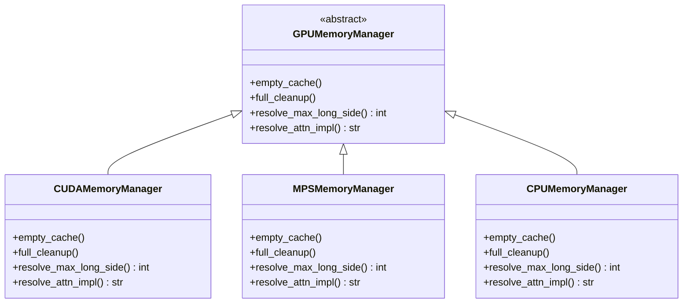

# GPU 内存管理重构 — 策略模式

## 问题

`if torch.cuda.is_available(): ... elif torch.backends.mps.is_available(): ...` 在两个服务文件中出现了 **8 次**，每次都是相似但略有差异的清理逻辑。新增设备类型时（如 XPU）需要改 8 个地方，极易遗漏（MPS 路径之前就是全部遗漏的证明）。

## 方案：策略模式

新建 `gpu_memory.py`，通过工厂函数根据设备类型返回对应的策略实例。所有服务代码只调用统一接口。



### 统一接口

| 方法 | 说明 | 调用场景 |
|---|---|---|
| `empty_cache()` | 轻量清理：只释放缓存，不触发 GC | 推理前释放碎片 |
| `full_cleanup()` | 重度清理：`gc.collect()` + 同步 + 清缓存 + ipc_collect | 推理后的彻底清理 |
| `resolve_max_long_side()` | 根据 GPU 显存返回最大图片长边 | 模块加载时 |
| `resolve_attn_impl()` | 根据设备返回注意力实现 | 模型加载时 |

---

## 修改文件

### [NEW] [gpu_memory.py](file:///Users/somnusochi/Documents/coding/locate-anything/backend/app/core/gpu_memory.py)

```python
"""GPU memory management — Strategy Pattern."""

from __future__ import annotations

import abc
import gc
import logging

import torch

logger = logging.getLogger(__name__)


class GPUMemoryManager(abc.ABC):
    """Abstract interface for device-specific memory management."""

    @abc.abstractmethod
    def empty_cache(self) -> None:
        """Lightweight cache release (before inference)."""

    @abc.abstractmethod
    def full_cleanup(self) -> None:
        """Heavy cleanup: gc + sync + cache + ipc (after inference)."""

    @abc.abstractmethod
    def resolve_max_long_side(self) -> int:
        """Max image long-side based on GPU VRAM."""

    @abc.abstractmethod
    def resolve_attn_impl(self) -> str:
        """Best attention implementation for this device."""


class CUDAMemoryManager(GPUMemoryManager):
    def empty_cache(self) -> None:
        torch.cuda.empty_cache()

    def full_cleanup(self) -> None:
        gc.collect()
        torch.cuda.empty_cache()
        torch.cuda.ipc_collect()

    def resolve_max_long_side(self) -> int:
        total_mb = torch.cuda.get_device_properties(0).total_memory // (1024 * 1024)
        if total_mb >= 16 * 1024:
            return 1333
        elif total_mb >= 12 * 1024:
            return 1024
        return 800

    def resolve_attn_impl(self) -> str:
        try:
            import flash_attn  # noqa: F401
            logger.info("flash_attention_2 available")
            return "flash_attention_2"
        except ImportError:
            logger.info("flash-attn not installed, using sdpa")
        return "sdpa"


class MPSMemoryManager(GPUMemoryManager):
    def empty_cache(self) -> None:
        torch.mps.empty_cache()

    def full_cleanup(self) -> None:
        gc.collect()
        torch.mps.synchronize()
        torch.mps.empty_cache()

    def resolve_max_long_side(self) -> int:
        return 1024  # Apple Silicon unified memory

    def resolve_attn_impl(self) -> str:
        return "sdpa"


class CPUMemoryManager(GPUMemoryManager):
    def empty_cache(self) -> None:
        pass  # no GPU cache

    def full_cleanup(self) -> None:
        gc.collect()

    def resolve_max_long_side(self) -> int:
        return 800

    def resolve_attn_impl(self) -> str:
        return "sdpa"


def create_memory_manager(device: str) -> GPUMemoryManager:
    """Factory: pick the right strategy based on device string."""
    if device == "cuda" and torch.cuda.is_available():
        return CUDAMemoryManager()
    elif device == "mps" and torch.backends.mps.is_available():
        return MPSMemoryManager()
    return CPUMemoryManager()
```

---

### [MODIFY] [locate_anything.py](file:///Users/somnusochi/Documents/coding/locate-anything/backend/app/services/locate_anything.py)

- 删除 `_resolve_attn_impl()` 函数
- 删除 `_resolve_max_long_side()` 函数
- 导入并使用 `create_memory_manager`
- 将所有 8 处 if/elif GPU 分支替换为 `gpu_mem.empty_cache()` 或 `gpu_mem.full_cleanup()`

替换前后对比：
```diff
-if torch.cuda.is_available():
-    torch.cuda.empty_cache()
-    torch.cuda.ipc_collect()
-elif torch.backends.mps.is_available():
-    torch.mps.synchronize()
-    torch.mps.empty_cache()
+gpu_mem.full_cleanup()
```

---

### [MODIFY] [sam2_service.py](file:///Users/somnusochi/Documents/coding/locate-anything/backend/app/services/sam2_service.py)

同样替换所有 GPU 分支为 `gpu_mem.empty_cache()` / `gpu_mem.full_cleanup()`。

---

## 收益

| 改造前 | 改造后 |
|---|---|
| 8 处 if/elif 分支，每处 3-5 行 | 8 处一行调用 |
| 新增设备类型需改 8 个地方 | 只需新增一个 Manager 子类 |
| MPS 路径遗漏了两个月才发现 | 不可能遗漏——接口强制实现 |
| 清理逻辑不一致（有的有 sync，有的没有） | 统一在 Manager 内部处理 |

## 验证方案

- `py_compile` 编译通过
- 已有功能不变：detect/segment 调用路径不变
