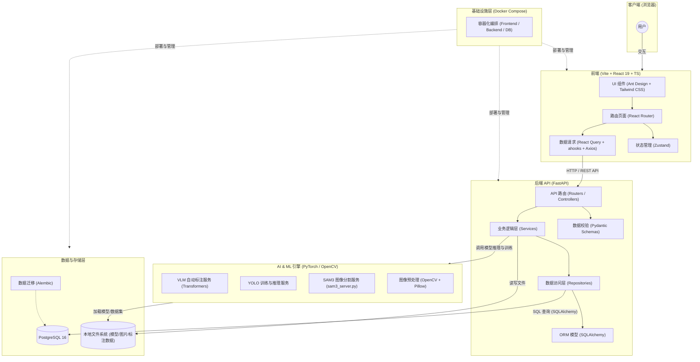
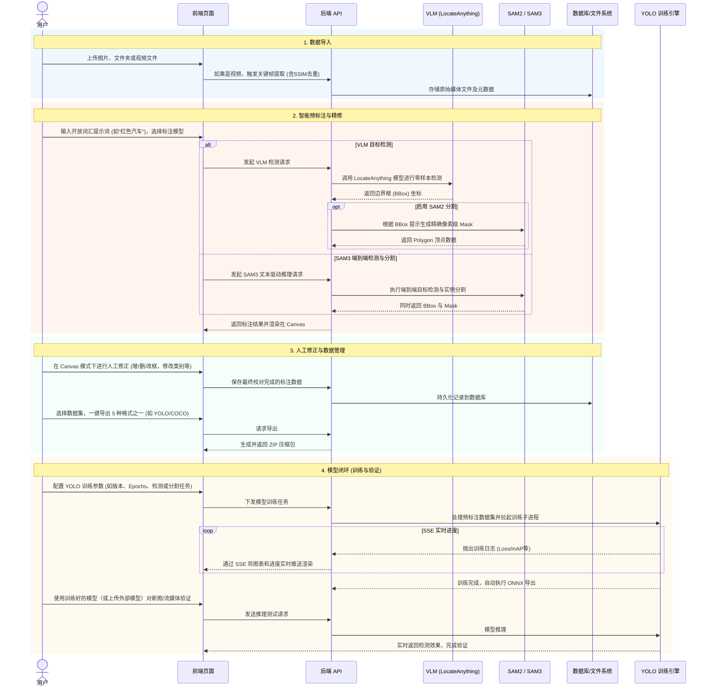

# VLM-AutoYOLO 项目架构设计图

根据对当前代码库的分析，这是一个全栈架构的 AI 平台，主要用于基于视觉语言模型（VLM）的自动标注以及 YOLO 模型训练。项目采用了现代化的前后端分离架构，并通过 Docker Compose 进行容器化部署。

以下是系统的整体架构图：

## 架构说明

### 1. 前端层 (Frontend)
- **核心框架**：使用 Vite 构建的 React 19 单页应用 (SPA)。
- **样式与 UI**：采用 `Ant Design` 配合 `Tailwind CSS` 进行响应式和现代化界面开发，并配置了 `unocss` 进行样式处理。
- **状态管理**：使用轻量级的 `Zustand` 管理全局状态。
- **数据请求**：结合 `Axios`, `React Query` 和 `ahooks`（如 `useRequest`）进行高效的异步数据获取和缓存管理。
- **国际化**：支持 `react-i18next` 提供多语言支持。

### 2. 后端层 (Backend)
- **核心框架**：基于 `FastAPI` 构建的高性能异步 RESTful API。
- **架构模式**：采用经典的分层架构：
  - **Routers/API**: 处理 HTTP 请求和路由分发。
  - **Schemas**: 使用 `Pydantic` 进行请求和响应的数据校验。
  - **Services**: 封装核心业务逻辑。
  - **Repositories**: 抽象数据库访问逻辑，解耦业务与数据层。
  - **Models**: `SQLAlchemy` ORM 模型定义。

### 3. AI & ML 引擎 (AI Engine)
- 此层主要与机器学习相关，是自动标注和模型训练的核心：
  - **VLM 自动标注**：使用 `Transformers` 库加载和运行大规模视觉语言模型进行零样本（Zero-shot）标注。
  - **SAM3 服务**：项目中存在独立的 `sam3_server.py`，可能用于高质量的图像分割。
  - **YOLO 训练**：集成目标检测模型（YOLO）的训练流程。
  - 依赖 `PyTorch` (`torch`) 和 `OpenCV` 进行张量计算和图像处理。

### 4. 数据与存储层 (Storage)
- **关系型数据库**：使用 `PostgreSQL 16` 存储结构化数据（如任务、用户配置、标注元数据等）。
- **数据库迁移**：使用 `Alembic` 管理数据库 schema 的版本迭代。
- **文件存储**：本地挂载的 Volume（如 `model-cache`, `uploads`, `training_runs`）用于存储权重文件、上传的图片和训练输出。

### 5. 基础设施 (Infrastructure)
- 项目依赖 `docker-compose.yml` 实现了一键部署，将前端 (`frontend`)、后端 (`backend`) 和 数据库 (`db`) 编排在同一网络中，简化了环境配置。

## 核心业务流程 (Workflow)

整个平台的业务流程设计紧扣“数据输入 -> AI 预处理 -> 人工校对 -> 模型产出”的飞轮机制，具体交互流程如下：

