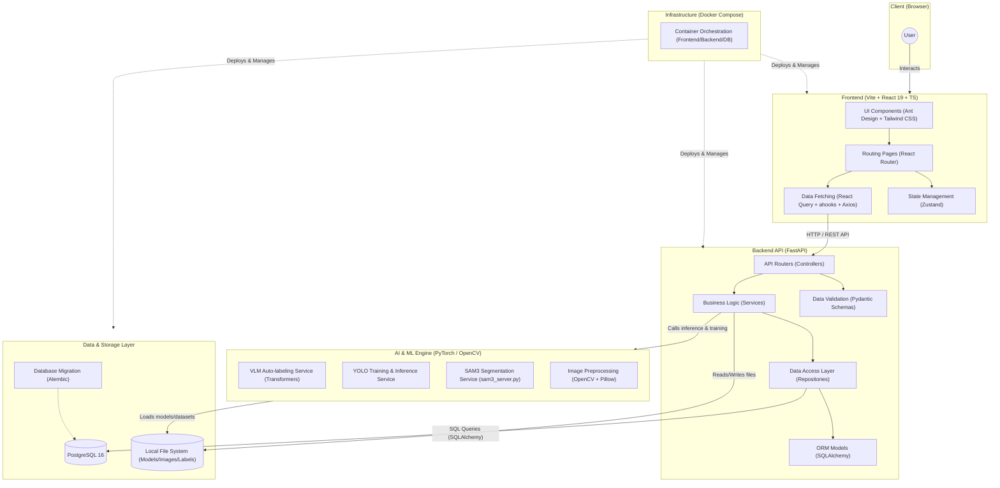
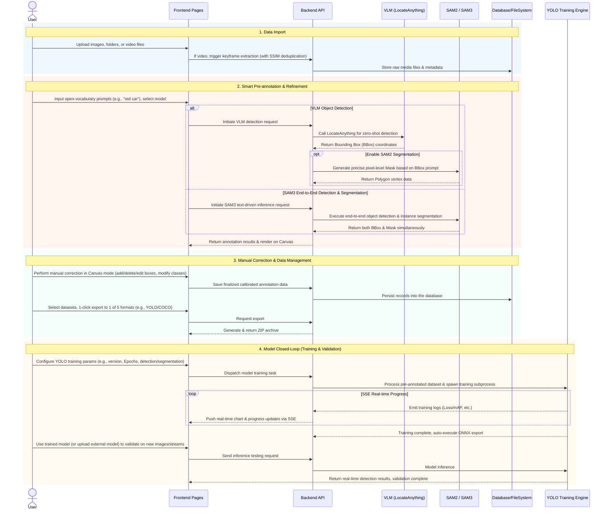

# VLM-AutoYOLO Architecture Design Diagram

Based on the analysis of the current codebase, this is a full-stack AI platform primarily designed for Visual Language Model (VLM) powered auto-labeling and YOLO model training. The project adopts a modern decoupled frontend and backend architecture, containerized and orchestrated using Docker Compose.

The overall system architecture diagram is as follows:

## Architecture Details

### 1. Frontend Layer
- **Core Framework**: React 19 Single Page Application (SPA) built with Vite.
- **Styling & UI**: Utilizes `Ant Design` combined with `Tailwind CSS` for responsive and modern UI, configured with `unocss` for utility-first styling.
- **State Management**: Uses lightweight `Zustand` for global state management.
- **Data Fetching**: Combines `Axios`, `React Query`, and `ahooks` (e.g., `useRequest`) for efficient asynchronous data fetching and cache management.
- **Internationalization**: Supports multi-language via `react-i18next`.

### 2. Backend Layer
- **Core Framework**: High-performance asynchronous RESTful API built with `FastAPI`.
- **Architecture Pattern**: Adopts a classic layered architecture:
  - **Routers/API**: Handles HTTP requests and route dispatching.
  - **Schemas**: Uses `Pydantic` for request and response data validation.
  - **Services**: Encapsulates core business logic.
  - **Repositories**: Abstracts database access logic, decoupling business from the data layer.
  - **Models**: `SQLAlchemy` ORM model definitions.

### 3. AI & ML Engine
- This layer is primarily related to machine learning, serving as the core for auto-labeling and model training:
  - **VLM Auto-labeling**: Uses the `Transformers` library to load and run large-scale visual language models for zero-shot annotation.
  - **SAM3 Service**: Contains an independent `sam3_server.py` for high-quality image segmentation.
  - **YOLO Training**: Integrates the training pipeline for object detection models (YOLO).
  - Relies on `PyTorch` (`torch`) and `OpenCV` for tensor computation and image processing.

### 4. Data & Storage Layer
- **Relational Database**: Uses `PostgreSQL 16` for storing structured data (e.g., tasks, user settings, label metadata).
- **Database Migration**: Uses `Alembic` to manage database schema versioning.
- **File Storage**: Locally mounted Volumes (e.g., `model-cache`, `uploads`, `training_runs`) for storing model weights, uploaded images, and training outputs.

### 5. Infrastructure
- The project relies on `docker-compose.yml` for one-click deployment, orchestrating the frontend (`frontend`), backend (`backend`), and database (`db`) in the same network, simplifying environment configuration.

## Core Business Workflow

The business workflow of the platform is tightly designed around the "Data Input -> AI Preprocessing -> Human Calibration -> Model Output" flywheel mechanism. The specific interaction flow is as follows:

